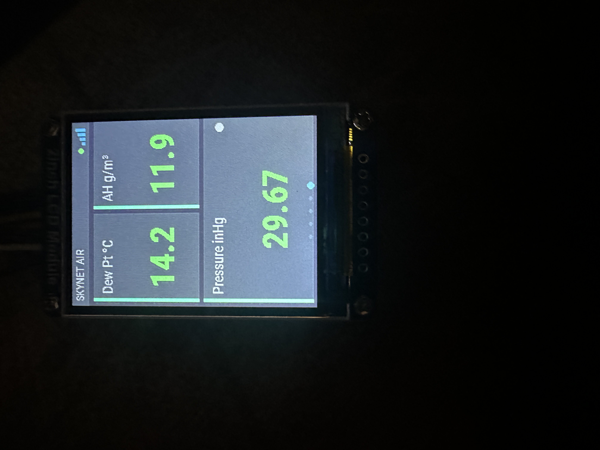

# Skynet-AirMultiSensor

| Front | Back |
|:---:|:---:|
|  |  |

An ESPHome air-quality and climate monitor built on an ESP32, combining six sensors: a DHT22 for temperature and humidity, a Sensirion SHT41 for high-accuracy temperature and humidity, a Sensirion SCD41 for true NDIR CO2, a Sensirion SEN55 for PM1.0/2.5/4.0/10 particulates plus VOC and NOx indices, a MICS-4514 for nitrogen dioxide, carbon monoxide, hydrogen, ethanol, methane, and ammonia, and a BMP390 for barometric pressure.  Extensive thermal considerations to provide as accurate sensor readings as possible, along with multiple calibration tools. The BMP390 provides on-board pressure compensation to the SCD41 for accurate CO2 readings without needing an external automation. Tight integration with Home Assistant, with sensors and calibration tools exposed via API. A 240×320 ST7789V color display shows the readings in one of three user-selectable modes, with every value color-coded green, amber, or red against configurable thresholds. Display mode, page rotation speed, sensor polling interval, temperature units, and backlight brightness are all adjustable from Home Assistant. The device also acts as an active Bluetooth proxy and BLE tracker.

---
## 📋 Table of Contents

- [Features](#features)
- [3D Model](#case-3d-model)
- [Hardware Bill of Materials (BOM) & Purchase Links](#-hardware-bill-of-materials-bom--purchase-links)
- [Saftey Notice](#safety-notice)
- [Wiring](#wiring)
- [Assembly](#assembly)
- [Software Installation](#softwarefirmeware-installation)
- [Home Assistant Integration](#home-assistant-integration)
- [Calibration](#calibrations)
- [References](#references)
 
 ---


## Features

- **High Accuracy Sensors** - Top-of-class specific sensor choices based on published accuracy data.  No more eCO2 or index gas levels.
- **16 live measurements** across temperature, humidity, CO2, particulates, VOC/NOx, and six trace gases
- **On-board barometric pressure** — BMP390 feeds the SCD41 pressure compensation automatically, no external automation needed
- **4-sensor temperature/humidity fusion** — inverse-variance weighted average of DHT22, SCD41, SEN55, and SHT41, with automatic outlier rejection
- **Three display modes**, switchable from Home Assistant:
  - **All 16** — dense single page, every value at once
  - **Rotating** — four pages of four values in large type, auto-advancing, with page indicator dots
  - **Highlight** — static page showing temperature, VOC, CO2, and PM2.5 only
- **Threshold color coding** — green below moderate, amber above moderate, red above high; thresholds drawn from EPA AQI breakpoints, WHO guidance, and OSHA/NIOSH exposure limits
- **Tight Integration with Home Assistant / ESPHome** — no reflashing needed to change display mode, rotation speed, sensor polling interval, °F/°C, or backlight brightness
- **Bluetooth proxy** — active proxy with 3 connections plus continuous BLE tracking, extending Home Assistant's Bluetooth range
- **Extensive Calibration Options** - For those who need even more accuracy! Temp, Humidity, CO2 calibrations
- **Gaussian Sensor Weighting** - provides a fused temperature and humidity reading based on the published performance of all four temperature/humidity sensors (DHT22, SCD41, SEN55, SHT41). The SHT41 carries the highest weight due to its superior accuracy (±0.2°C).
- **Thermal Optimization** Thermal considerations and isolation were a big part of the case design, trying to prevent sensor/display related heating to effect sensor readings. Case designed to have the hot sensors far from the cooler sensors, and all sensors exposed to outside air instead of inside, and thermal insulation between center chamber and side chambers, and cooling chimneys on the top.

| Thermal Front | Thermal Back | 3D Print |
|:---:|:---:|:---:|
|  |  |  |

---

## Case 3D Model
All 3D printable files and print profiles for the enclosures are hosted on MakerWorld:

👉 [AirMultiSensor Case on MakerWorld](https://makerworld.com/en/models/3134930-skynet-air-multisensor)

---

## 🛒 Hardware Bill of Materials (BOM) & Purchase Links

| Component | Part | Interface | Link | Price $USD as of 8/26 |
|---|---|---|---|---|
| MCU | Freenove ESP32-WROOM (ESP32 rev3.1, 4MB flash, no PSRAM) | — | https://www.amazon.com/dp/B0C9THDPXP | 18.95 (for 2) |
| Temp / humidity | DHT22 (AM2302) | 1-Wire | https://www.amazon.com/dp/B0CPHQC9SF | 9.99 (for 3) |
| Temp / humidity (precision) | Sensirion SHT41 | I²C bus A | — | ~5 |
| CO2 | Sensirion SCD41 | I²C bus A | https://www.amazon.com/dp/B0GWQMQVN8 | 19.99 |
| Particulate / VOC / NOx | Sensirion SEN55 | I²C bus B | https://www.seeedstudio.com/Grove-All-in-one-Environmental-Sensor-SEN55-p-5373.html | $59 | 
| Trace gases | MICS-4514 | I²C bus A | https://www.amazon.com/dp/B09G9PZ4XZ | 42.90 |
| Barometric pressure | BMP390 (CJMCU-390) | I²C bus A | — | ~5 |
| Display | ST7789V 240×320 IPS, SPI | SPI (VSPI) | https://www.amazon.com/dp/B082GFTZQD | 17.27 |
| Grove breakout cable (optional) | — | — | https://www.amazon.com/dp/B074MDM36N | 9.99 (for 5) |
| M3x4 and M2x4 screws | - | - | - |
| USB-C power cable | - | - | - |

---

## Safety notice

**This is not a safety device.** The MICS-4514 is an uncalibrated metal-oxide sensor whose readings drift substantially with temperature and humidity; its ppm figures are useful as relative trends, not absolute concentrations. Do not rely on the carbon monoxide reading for life safety — use a certified CO alarm. The same applies to the methane channel and gas leak detection.

This project was made partially with assistance using Claude. 3D models were designed manually using OnShape.

---

## Wiring

You will be making two different I2C buses.  The SCD41 and 4515 chips are on one, and the SEN55 is by itself on the other.

There should be cables that came with the SCD41 grove chip, as well as the SEN55 Gravity sensor.  Below are the colors that I had:

Grove cable (for the Sen55) - white = SDA, Yellow = SCL, Red = 5V, Black = Ground

Gravity cable (for the SCD41) - green = SDA, Blue = SCL, Red = 3.3V, Black = Ground

1. Bus 1: Splice together and I2C "bus" for the SCD41 and Gravity 4515 chips (connect power, ground, SDA, SCL of the two sensors, and also connect them to jumpers that end in breadboard connectors to plug into the ESP32 pins).  SCL for this bus goes to RX (GPIO17), and SDA - GPIO26
2. Bus 2: Make a second I2C "bus" for the gravity SEN55 sensor - Can use the Gravity cable that comes with the chip and cut off the non-gravity side and splice onto breadboard connectors, or purchase the premade cable (link above). SCL for this bus goes to GPIO22, SDA - GPIO21
3. Power Bus#1 goes to 3.3V pin, Bus#2 goes to 5V, both buses ground goes to ground.

4. Make sure to solder the pins to the SCD41 board to the backside (opposite the sensor)
5. DHT22: 3.3V, GND, signal to GPIO25
6. SHT41: connect SDA to GPIO26, SCL to GPIO17, VCC to 3.3V, GND to GND (same bus as SCD41/MICS)
7. BMP390: connect SDA to GPIO26, SCL to GPIO17, VCC to 3.3V, GND to GND (same bus as SCD41/MICS)

6. Display hookup (these are the colors of the cable that came with my display, YMMV):
DC - blue - GPIO4
CS - yellow - GPIO5
RST - brown - GPIO27
CLK - orange - GPIO18
DIN (MOSI) - green - GPIO23
VCC - purple - 3.3V
GND - white - GND
BL - grey - GPIO32


## Assembly


1. Attach Display with M2x4 screws.  Plug goes on top.  Use a allen wrench key through the back holes to get the bottom two screws in.
2. Place SCD41, secure with two-sided tape on the front-facing side below the sensor box.
3. Attach DHT22 above it (with jumpers attached already) with M3x4 screws
4. Attach MICS with M2x4 screws
5. Slide the ESP32 in the center section, under the display, usb facing the hole and pins pointing up
6. Attach USB-C power cable into ESP32 through back hole.
7. Make sure the sensor cables that travel from the center section to the left/righ sections are sitting in the channel gaps in the separating walls before you put the lid on to prevent them being pinched.


## Software/Firmeware Installation

1. This assumes you're already running [ESPHome](https://esphome.io/) (2026.7.3 or later — the config uses `mipi_spi`).
2. Copy the contents of skynet-multisensor.yaml from this repo into an empty new device in ESPhome.
2. Add `wifi_ssid` and `wifi_password` to your `secrets.yaml` or add them to this yaml (instead of !secret wifi_ssid and !secret wifi_password)
3. Replace the AP password (!secret master_skynet_multisensor__ap_password), API encryption key (!secret master_skynet_multisensor__encryption_key), OTA password (!secret master_skynet_multisensor__ota_password), and uncomment and modify `use_address` with your own (optional).
4. Flash over USB the first time. **USB flashing is required at least once** — `sram1_as_iram: true` needs a bootloader from ESP-IDF 5.1 or later, and bootloaders do not update over OTA.  https://web.esphome.io/ works well.
5. Add the new device to home assistant / ESPHome integration.  You'll need the encryption key you made in step 3.

### Notes on first boot

- The MICS-4514 needs several minutes of heater warm-up before it reports; expect `--` on those values initially.
- The SEN55 VOC and NOx algorithms need hours to establish a baseline. Early index values are not meaningful.
- If the display renders as a photo negative, flip `invert_colors` in the display block. Roughly half of ST7789V panels want it one way, half the other.

---

## Home Assistant Integration


1) Diplay backlight - turning this off will blank display
2) Display mode:
    - All 16 - all 16 sensors on a single screen, but small
    - Rotating - 4 sensors on each screen (bigger), rotating through 5 pages (speed adjustable)
    - Highlights - 4 sensors on single screen (bigger) - temp, VOC, PM2.5, and CO2.

<p align="left">



</p>

3) Status LED - there is an on-chip light that is controlable, but probably not visable from outside the case.

---


1) Display Fahrenheit - If on, the display will show temp in F.  If not, C.  (both are transmitted to home assistant)
2) Display Rotation Speed - if on "rotating" diplay mode, this will adjust how fast the pages will cycle
3) Restart - will reboot ESP
4) Sensor update - adjust the update speed of all the sensors.  10s is the minimum.

---


1) Sensor data exposed to home assistant shown above.  Note "Temperature Fused" and "Humidity Fused" are calculated from all 4 temperature/humidity sensors (DHT22, SCD41, SEN55, SHT41) and weighted by known sensor accuracy. The SHT41 carries the highest weight. Absolute Humidity and Dew Point are also calculated from the fused data.
2) Wifi data also available "Diagnostic" panel - not pictured.

---

## Calibrations

1) Set Ambient Pressure: The SCD41 relies on accurate atmospheric pressures to report CO2 - not setting this can cause variations up to 20%.  If a BMP390 is installed, pressure compensation is handled automatically on-board — no automation needed. Otherwise, use a Home Assistant automation to pull current atmospheric pressure from some other sensor (or web API) in mbar and push it to the sensor.  Set an automation with a time trigger ~ 1 hr with the action:

```yaml
action: esphome.skynet_multisensor_set_ambient_pressure
data:
  pressure_mbar: "{{ states('sensor.air_pressure') | int(0) }}"
```
You can see the last "sent" pressure and how long ago it was updated to make sure your automation is feeding ESPHome correctly.


2) Temperature bias - there are three sensors that report temps (DHT22, SCD41, SEN55).  Care was taken to try to thermally isolate, but they still  experience local heating as the whole sensor package warms up over time.  Let the device become cold/room temperature (off for at least an hour) and then start it up.  Under the Diagnostic window in home assistant you'll find Boot temps and Warm temps (after 30 min) from the sensors, and a Bias estimate which is how much the temp rose (assuming the room stayed the same over those 30 minutes). Of note, these cold/warm values will only populate after a power-on from off (not just reset) to prevent you losing the values on simple reset (the point is to get these cold numbers after being powered off for a while). These value can be adjusted in the home assistant card.  You'll see they are unit-less degrees - they will represent F or C depending on how the "Display Fahrenheit" toggle is set.  A larger bias value will bring down the displayed temp from that sensor.  I have the offsets I measured on mine as the defaults.

<p align="left">


</p>

3) If you REALLY want you can calibrate the relative humidity with a salt calibration, these values are also in the YAML "rhbias_dht", etc.

4) SCD41 CO2 Automatic self-calibration assumes the sensor sees ~400 ppm background weekly. If this lives in a room that never fully vents, ASC will drag your baseline wrong and you won't know. There is a forced-calibration button (target 420 ppm, after 3+ min outdoors) so you can correct it without reflashing.  You will need to set "scd_asc" to false in the yaml if you plan on occasional manual outdoor calibrations, otherwise it will auto-calibrate back to the room CO2 in a week.  There is an ARM CO2 Calibration button that needs to be on first, to prevent accidental calibration runs.  Let it power on outside for 5 minutes to let the readings settle before running calibration.  If your outdoor CO2 isn't around 420, this can be adjusted in the YAML as well to calibrate it to the current outdoor CO2.


5) The Sen55 will autoclean weekly.  There is a button exposed to home assistant - "Clean SEN55 Fan" - if you would like to manually trigger a clean (the fan spins up to ~10s at full speed to blow it clear.)

---

## References

### I²C — two buses

Two separate buses are used because the SEN55 and SCD41 both benefit from short, clean runs, and splitting them keeps each bus lightly loaded.

| Bus | Signal | GPIO | Devices |
|---|---|---|---|
| **Bus A** | SDA | `GPIO26` | SCD41, MICS-4514, SHT41, BMP390 |
| **Bus A** | SCL | `GPIO17` | |
| **Bus B** | SDA | `GPIO21` | SEN55 |
| **Bus B** | SCL | `GPIO22` | |

Both buses run at 50 kHz. Bus A is 3.3V, Bus B is 5V. 

### DHT22

| Signal | GPIO |
|---|---|
| Data | `GPIO25` |

Internal pull-up is enabled in firmware.

### Display — ST7789V over SPI

The ST7789V is write-only, so there is no MISO connection.

| Display pin | GPIO | Notes |
|---|---|---|
| GND | GND | |
| VCC | 3.3 V | **not 5 V** — bare breakouts have no regulator |
| SCL / CLK / SCK | `GPIO18` | SPI clock |
| SDA / DIN / MOSI | `GPIO23` | SPI data — this is MOSI, *not* I²C |
| RES | `GPIO27` | Reset |
| DC | `GPIO4` | Data/command |
| CS | `GPIO5` | Chip select |
| BLK | `GPIO32` | Backlight, LEDC PWM, dimmable |


### Full GPIO map

| GPIO | Function |
|---|---|
| 4 | Display DC |
| 5 | Display CS |
| 16 | WS2812 status LED |
| 17 | I²C bus A — SCL |
| 18 | SPI CLK |
| 21 | I²C bus B — SDA |
| 22 | I²C bus B — SCL |
| 23 | SPI MOSI |
| 25 | DHT22 data |
| 26 | I²C bus A — SDA |
| 27 | Display RESET |
| 32 | Display backlight (PWM) |

GPIO5 is technically a strapping pin, but it's the ESP32's default VSPI CS and idles high, so it's safe here. ESPHome will warn about it regardless.

---

## Home Assistant entities

### Sensors

| Entity | Unit |
|---|---|
| DHT22 Temperature | °C |
| DHT22 Temperature F | °F |
| DHT22 Humidity | % |
| SHT41 Temperature | °C |
| SHT41 Humidity | % |
| BMP390 Temperature | °C |
| BMP390 Pressure | inHg |
| Temperature Fused | °C |
| Humidity Fused | % |
| Absolute Humidity | g/m³ |
| Dew Point | °C |
| CO2 | ppm |
| SD41 Temperature / Humidity | °C / % |
| PM <1µm, <2.5µm, <4µm, <10µm | µg/m³ |
| Sen55 Temperature / Humidity | °C / % |
| VOC / NOx | index |
| Nitrogen Dioxide, Carbon Monoxide, Hydrogen, Ethanol, Methane, Ammonia | ppm |
| WiFi Signal dB / Percent | dBm / % |

### Controls

| Entity | Type | Range / options |
|---|---|---|
| Display Mode | select | All 16 · Rotating · Highlight |
| Display Rotate Seconds | number | 2–60 s |
| Sensor Update Seconds | number | 10–600 s |
| Display Fahrenheit | switch | on / off |
| Display Backlight | light | dimmable |
| Status LED | light | RGB |
| Restart | switch | — |

---

## Thresholds

Set in `substitutions:` at the top of the YAML. Each value has a *moderate* and *high* cutoff.

| Measurement | Moderate | High | Basis |
|---|---|---|---|
| Temperature | 80 °F / 26 °C | 90 °F / 32 °C | comfort |
| Humidity | 60 % | 70 % | comfort / mould risk |
| Absolute humidity | 12 g/m³ | 17 g/m³ | comfort |
| CO2 | 1000 ppm | 1500 ppm | common IAQ guidance |
| PM1.0 / PM2.5 | 12 µg/m³ | 35 µg/m³ | EPA AQI breakpoints |
| PM4.0 | 25 µg/m³ | 50 µg/m³ | interpolated |
| PM10 | 54 µg/m³ | 154 µg/m³ | EPA AQI breakpoints |
| VOC index | 150 | 250 | Sensirion (100 = baseline) |
| NOx index | 20 | 150 | Sensirion (1 = clean) |
| NO2 | 0.05 ppm | 0.10 ppm | WHO |
| CO | 9 ppm | 35 ppm | EPA 8 h / 1 h standards |
| H2 | 50 ppm | 100 ppm | relative |
| Ethanol | 50 ppm | 100 ppm | relative |
| Methane | 1000 ppm | 5000 ppm | ~2 % / ~10 % of LEL |
| Ammonia | 25 ppm | 50 ppm | NIOSH REL / OSHA PEL |

Thresholds are one-sided — they only flag values that are too *high*. A cold room shows green.

## License

[PolyForm Noncommercial License 1.0.0](LICENSE) — free for personal, hobby, educational, research, and nonprofit use. Commercial use is not permitted.
